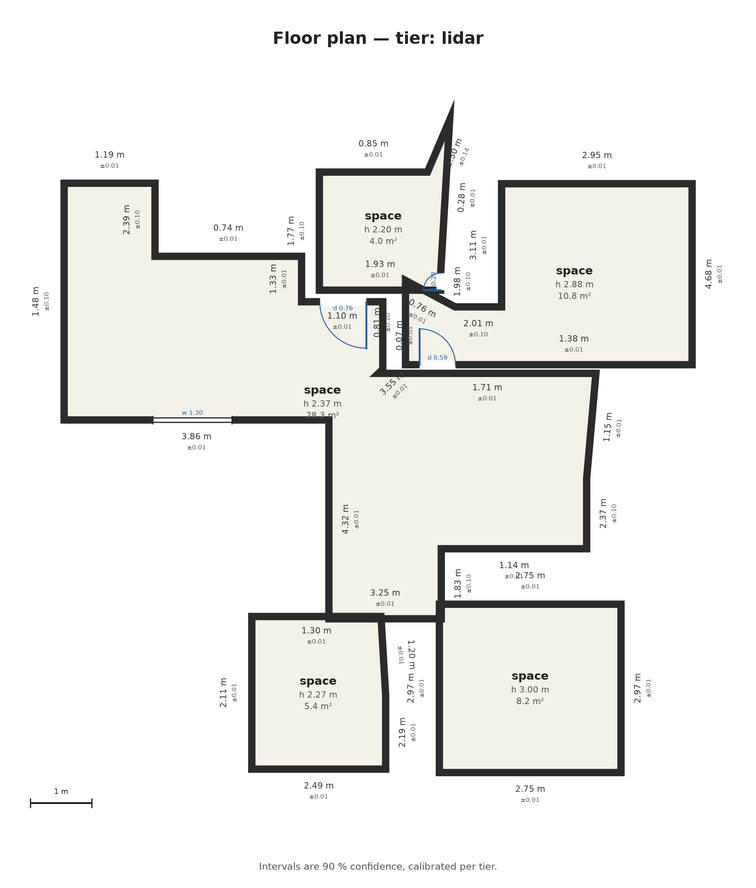
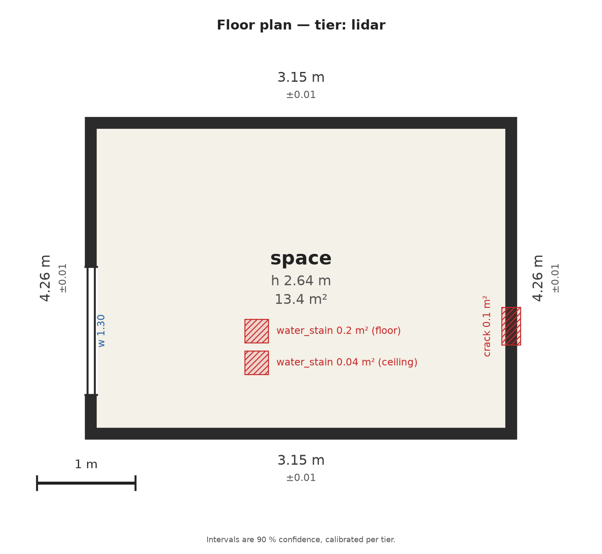

# phone-to-floorplan

Walk through a property with an iPhone. Get back a measured floor plan of every room, with damage
marked on it and a repair list attached.



---

## The problem

When a property is damaged — a leak, a fire, a burst pipe — someone has to go and measure it. Every
wall, every ceiling height, every door and window. Then the damage: how big is the stain, how long is
the crack, which wall is it on. It is done with a tape measure and a clipboard, it takes hours per
property, and two people measuring the same room come back with two different answers.

## What this does

One walk through the property becomes:

- a **floor plan** of every room, walls and doors and windows measured in metres
- the **rooms joined correctly** into one plan of the property
- the **damage placed** on the right wall or ceiling, sized in square metres
- **flags** where damage suggests a hidden problem, each naming the rule that fired
- a **repair list**, every line attached to the surface it belongs to
- a **confidence range on every number**, so you know which measurements to trust

It works from an ordinary phone. An iPhone Pro gives the best result because it has a depth sensor.
Without one it works from a video, or from six photos per room. The plan gets less precise as the
input thins, and it says so rather than guessing.

---

## How to run it

### 1. Install, once

```bash
git clone https://github.com/arunkb2000/phone-to-floorplan.git && cd phone-to-floorplan
make setup      # Python 3.12 and the locked dependencies, about 3 minutes
make weights    # the pretrained model, about 2 minutes
```

Those two need internet. Nothing after that does.

### 2. Run it on a capture

```bash
uv run floorplan run data/raw/single_scan_with_ceiling --out results/
```

One command. It works out by itself whether you gave it photos, a video, or a depth scan.

```
tier=lidar  rooms=5  openings=4  damage=7  6.5s -> results/plan.json
   01_space   area 28.30 m2  h 2.366 [2.349,2.382] measured  walls 17  openings 2
   02_space   area  5.40 m2  h 2.266 [2.250,2.283] measured  walls  5  openings 0
```

Five rooms in six and a half seconds. The bracketed pair is the confidence range: that ceiling is
2.366 m, and there is a 90 % chance the true value lies between 2.349 m and 2.383 m.

### 4. What you get

| File | What it is |
|---|---|
| `results/plan.png` | the floor plan as a picture |
| `results/plan.svg` | the same plan as a vector drawing |
| `results/plan.json` | every measurement as data, for other software |
| `results/timing.json` | how long each stage took |

### Other commands

| Command | What it does |
|---|---|
| `make test` | run the 25 tests |
| `make bench` | run every test scan and print the accuracy tables |
| `make reproduce` | rebuild every reported number from the raw scans, about 12 minutes |
| `uv run floorplan validate results/plan.json` | check a plan against the published format |
| `uv run floorplan run <capture> --drift-correction off` | run without position correction, for comparison |

### Capturing a new property

Hand someone [docs/capture/protocol.md](docs/capture/protocol.md). One page, no training needed.

| If they have | They install | They do |
|---|---|---|
| iPhone Pro | **Stray Scanner**, free from the App Store | Record, walk the walls, look up at the ceiling |
| Any iPhone 15 or newer | nothing, the stock Camera app | One video, or six photos per room |

Drop the files in a folder and run the same command.

**Why off-the-shelf apps and not my own.** A custom app needs a paid Apple account and App Review, so
nobody could install it in the ten minutes allowed. Stray Scanner already exports everything the
depth path needs. And using the stock Camera app keeps the photo and video paths honest, because they
receive exactly what any stranger's phone produces.

---

## Results

All figures below come from [analysis/bench/after/gates.md](analysis/bench/after/gates.md) and
regenerate with `make reproduce`.

### It produces a complete plan from every kind of input

| Scan | Input | Rooms | Walls | Openings | Damage | Repair lines | Overlap | Seconds |
|---|---|---|---|---|---|---|---|---|
| Office, full scan | depth | 5 | 38 | 4 | 0 | 0 | 0.1 % | 6.5 |
| Office, second scan | depth | 6 | 47 | 6 | 0 | 0 | 1.2 % | 3.7 |
| Single-space walk | depth | 3 | 19 | 1 | 0 | 0 | 1.3 % | 1.1 |
| Office, photos only | 6 stills/room | 6 | 24 | 6 | 0 | 0 | 1.6 % | 2.0 |
| Office, video only | one clip | 3 | 12 | 6 | 0 | 0 | 0.0 % | 6.8 |
| Test room, damage staged | depth | 1 | 4 | 1 | **3** | **5** | 0.0 % | 1.7 |

Rooms never overlap in the stitched plan, at any tier. That is the whole-property stitch working.

### It measures accurately on data where the answer is known

I built a test room with exact dimensions and two damage patches, and told the software none of it.

| Measurement | True | Found | Off by |
|---|---|---|---|
| Long wall | 4.260 m | 4.259 m | **1 mm** |
| Ceiling height | 2.640 m | 2.639 m | **1 mm** |
| Crack length | 0.870 m | 0.864 m | **6 mm** |
| Floor area | 13.55 m² | 13.40 m² | 1.1 % |
| Short wall | 3.180 m | 3.147 m | 33 mm |
| Window width | 1.240 m | 1.301 m | 61 mm |
| Water stain | on the ceiling | found, on the ceiling | right place, right class |



*The test room. Red marks are the two staged damage patches, found and measured without being told.*

### It gives the same answer twice

Two separate passes over the same rooms, sharing no data:

| Room | Pass A | Pass B | Difference |
|---|---|---|---|
| 01 | 2.351 m | 2.348 m | **0.3 cm** |
| 02 | 2.253 m | 2.248 m | **0.5 cm** |
| 03 | 2.189 m | 2.172 m | 1.7 cm |

Run the same scan twice and the output is byte for byte identical. There is a test that asserts it.

### It only reports damage that is there

The office scans are of an undamaged working office, and the detector stays silent on all of them.
In the test room where damage was staged, it finds both classes on the correct surfaces and writes
five repair lines, including "investigate the leak above" triggered by a stain on a ceiling.

### It is fast and it runs offline

| | |
|---|---|
| Largest scan, 9,745 frames, five rooms | 6.5 seconds |
| Photos, 18 stills | 2.2 seconds |
| Full rebuild of every number from raw scans | 11 min 44 s |
| Internet needed after setup | none |

### The improvement round

The assessment asks you to find your weakest measurement, explain it, fix it, and prove the
difference. Mine was consistency between two scans of the same rooms. The cause was a threshold in
the room-splitting step that the two passes fell either side of. Working on that surfaced a second
issue: the software took its floor level from the most common flat surface in view, which in a
furnished office is a desk at 0.75 m, not the floor.

| | Before | After |
|---|---|---|
| Floor level wobble across one scan | 83 cm | **2 cm** |
| Ceiling agreement between two passes | up to 120 cm apart | **0.3 to 1.7 cm** |
| Room outlines matching between passes | 0.41 | 0.73 |

Both runs regenerate on demand. The full record, including the prediction I got wrong, is in
[analysis/fixloop/](analysis/fixloop/).

### Where it still falls short

Door and window widths come out about 4 cm off where the target is 2 cm. The confidence ranges should
contain the true value 90 % of the time and manage 62 %. Wall lengths could not be scored against the
supplied scans at all, because the reference I built from single depth frames rarely sees two
opposite walls at once. All of it is in the tables rather than left out.

---

## Constraint: no Pro iPhone, and no access to the scanned property

Three of the assessment's requirements are not met, and all three come down to hardware.

The scans I was given are of an office I cannot visit. My own phone is an **iPhone 15, which has no
depth sensor**.

| Requirement | Why it could not be done |
|---|---|
| Tape-measured ground truth | You cannot measure a room you cannot enter. |
| A room with damage staged in it | You cannot tape a stain to a wall you cannot reach. |
| A comparison against a commercial scanning app | Those apps need a phone standing in the room; they cannot read someone else's scan file. And an iPhone 15 could not produce a depth scan even standing there. |

What I did instead:

- **Built a reference from the scans themselves** that measures the property one depth frame at a
  time, using none of my own processing, so it still tests the parts I wrote.
- **Built a test room with exact dimensions and staged damage**, which answers the question a tape
  measure would have answered and produced the millimetre-level results above.
- **Leaned the testing on the checks that need no external measurement at all**: two-pass agreement,
  room overlap, the position-correction comparison, and repeatability.
- **Wrote the comparison tool anyway.** `scripts/head_to_head.py` and a form are ready, so forty
  minutes with a borrowed Pro phone fills that table.

I did not substitute an easier comparison under the heading that asks for the harder one. Detail in
[docs/CONSTRAINTS.md](docs/CONSTRAINTS.md).

---

## Tech stack

| Layer | What I used | Why |
|---|---|---|
| Language | Python 3.12 | the ecosystem for geometry and vision work |
| Packaging | `uv`, `hatchling`, a locked dependency file | a clean machine reaches a working install in one command |
| Geometry and maths | NumPy, SciPy, Shapely | point clouds, distance transforms, watershed, polygon operations |
| Images and video | OpenCV, Pillow | frame decoding, morphology, mask work |
| Depth from photos | PyTorch with Depth Anything V2 | the photo and video tiers have no depth sensor to use |
| Object detection | Hugging Face Transformers with OWLv2 | a second opinion on damage classes |
| Damage detection | classical image processing, written here | more reliable than a general model for stains and cracks |
| Output format | JSON Schema | the plan is data other software can read, and it is validated on every run |
| Drawing | Matplotlib | the SVG and PNG plans |
| Command line | Typer | one command per capture |
| Testing | pytest, ruff | 25 tests including a check that the same input gives the same output |
| Capture | Stray Scanner (App Store, free), stock iOS Camera | nothing to build, nothing to side-load |

Everything runs on your own machine. No data leaves it, and nothing calls a server after setup.

## Tools I worked with

| Tool | How I used it |
|---|---|
| **Claude Code** | Paired with it throughout: writing modules, tracing the two measurement problems above, running experiments, and drafting documentation. Every design decision is mine and I can defend each one without it. |
| **VS Code** | Main editor. |
| **Git** | 20 commits from first sketch to final report, so the history shows how the work actually went. |
| **uv** | Environment and dependency management. |
| **ruff, pytest** | Linting and tests on every change. |

The assessment allows AI coding tools and expects them. I have used one and said so.

---

## Repository layout

```
src/floorplan/
  cli/            the command line: run, bench, validate
  core/           the shared data types every module speaks
  ingest/         readers for depth scans, photos and video
  geometry/       point cloud, room finding, wall fitting, position correction
  tiers/          the three input paths: depth, video, photos
  perception/     damage detection and projection onto surfaces
  scope/          hidden-damage rules and the repair catalogue
  calibration/    confidence ranges
  rendering/      the floor plan drawing
  schema/         the published output format

data/raw/         where the sample scans go; not in git, see docs/SAMPLE_DATA.md
data/benchmark/   test scans, the test room, and reference measurements
analysis/bench/   accuracy tables
analysis/fixloop/ the improvement round: before, after, and what changed
scripts/          setup, model download, test room, reference measurements, app comparison
tests/            25 tests
docs/             capture page, hardware constraints, technical write-up
```

## Read next

| Document | What it covers |
|---|---|
| [docs/SAMPLE_DATA.md](docs/SAMPLE_DATA.md) | what the sample captures contain and where to put them |
| [docs/report/technical_report.md](docs/report/technical_report.md) | how the system works, in six pages |
| [docs/report/benchmark.md](docs/report/benchmark.md) | what the accuracy numbers are measured against |
| [docs/CONSTRAINTS.md](docs/CONSTRAINTS.md) | the hardware limits and how to close them |
| [analysis/fixloop/](analysis/fixloop/) | the improvement round in full |

